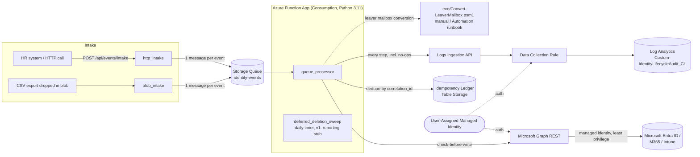

# Identity Lifecycle Automation (Joiner / Mover / Leaver)

Event-driven joiner/mover/leaver automation for Microsoft Entra ID + Microsoft
365, built as public engineering evidence for manual IAM operations experience.
An Azure Function (Python v2 programming model) processes HR lifecycle events
from a queue, calls Microsoft Graph with least-privilege, managed-identity
auth, and writes a full audit trail to a Log Analytics custom table.

**Jira:** Epic [EP-1](https://spreadcomgh.atlassian.net/browse/EP-1), stories EP-7…EP-13
**Status:** Build complete through EP-13 scope (code, infra-as-code, CI/CD
definitions, tests, docs). Cloud deployment and end-to-end testing on a real
tenant are separate, tracked steps — see [Remaining TODOs](#remaining-todos).

---

## Architecture



**Design choices worth calling out:**

- **Plain REST + a thin `GraphClient` wrapper (`src/identity_lifecycle/graph_client.py`)**
  instead of the full `msgraph` SDK — smaller dependency surface, and every
  method is easy to fake in unit tests without mocking a generated client.
- **Check-before-write everywhere.** Every `GraphClient` mutation method reads
  current state first and no-ops if the desired state already holds. That's
  what makes a flow safe to replay even if the event-level idempotency ledger
  were unavailable.
- **Two layers of idempotency**: mutation-level (above) plus an event-level
  ledger keyed on `(event_type, correlation_id)` in Azure Table Storage, so a
  Storage Queue redelivery (at-least-once) short-circuits before making any
  Graph calls at all.
- **Audit logging never fails a flow.** `AuditLogger` tries the Log Analytics
  Logs Ingestion API first; any failure (including "not configured", e.g.
  local dev) falls back to structured JSON logging, and the exception is
  swallowed — an audit sink outage must never block a joiner/mover/leaver
  action from completing.
- **EXO mailbox conversion is isolated.** Exchange Online mailbox operations
  aren't reachable the same way directory objects are via Graph application
  permissions in a Python Function App without extra plumbing, so mailbox
  conversion is a separate, documented PowerShell module
  (`exo/Convert-LeaverMailbox.psm1`) run manually or from an Azure Automation
  runbook — see [Leaver flow](#leaver-flow).
- **Deferred deletion is a stub, on purpose.** The leaver flow computes and
  audits a 30-day deletion due date; it never deletes anything. The daily
  timer function (`deferred_deletion_sweep`) is a v1 reporting-only stub — a
  deliberate safety rail against a bad or replayed HR feed silently deleting
  accounts. Wiring in the real (confirmed, gated) delete call is a tracked
  fast-follow once the flows are validated end-to-end on the dev tenant.

---

## Repository layout

```
function_app.py               Azure Functions v2 entrypoint (4 triggers)
src/identity_lifecycle/
  config.py                   Settings from env vars + department->group mapping
  models.py                   UserEvent / ParsedBatch pydantic schemas
  parsing.py                  CSV/JSON intake -> validated UserEvent list
  graph_client.py             Thin Graph REST wrapper, check-before-write
  idempotency.py               Event-level dedupe ledger (in-memory + Table Storage)
  audit.py                    Structured audit logging (Log Analytics + local fallback)
  flows/
    base.py                   FlowOutcome / FlowStep result types
    joiner.py                 Joiner flow
    mover.py                  Mover flow
    leaver.py                 Leaver flow
exo/
  Convert-LeaverMailbox.psm1  Isolated EXO mailbox-conversion module (manual/Automation)
infra/
  main.bicep                  Orchestrator (dev/prod parameterized)
  modules/                    managed identity, storage, Log Analytics/DCR, App Insights, Function App
  parameters/                 dev.bicepparam, prod.bicepparam
.github/workflows/
  ci.yml                      ruff + pytest + bicep build, on every PR/push
  deploy.yml                  OIDC login, what-if on PR, deploy on push to dev/master
tests/unit/                   pytest suite (parsing, idempotency, each flow, audit, graph client)
samples/                      Example joiner/mover/leaver CSV + JSON payloads
```

---

## Flow descriptions

### Joiner flow (EP-9)

Trigger: an HR "new hire" event (HTTP call or CSV row).

1. Create the Entra user if it doesn't already exist (idempotent on UPN).
2. Set the manager reference, if `manager_upn` is supplied and resolves.
3. Add the user to their department's security group and group-based
   licensing group (see [department mapping](#department--group-mapping) below).
4. Issue a Temporary Access Pass for passwordless first sign-in.
5. Send a welcome email with sign-in instructions — **only** on the run that
   actually created the user (gated on the `created` flag), so replaying the
   event never sends a duplicate email even though Graph has no "already
   emailed" state to check.

Re-sending the same joiner event is safe: every step observes the target
state already holds and reports `skipped`, and zero additional Graph writes
happen (see `tests/unit/test_joiner.py::test_joiner_replay_is_fully_idempotent`).

### Mover flow (EP-10)

Trigger: a department/manager/title change event.

Rather than inferring the user's *previous* department from the event (HR
feeds don't reliably supply it), the flow treats the union of every group
referenced by any configured department mapping as "automation-managed" and
reconciles membership to exactly what the *new* department maps to — added if
missing, removed if no longer in scope, left untouched if it's not a
managed group at all (e.g. a manually-added project group). Job title,
department attribute, and manager are updated the same check-before-write way.
Every change (and no-op) is logged, plus one `access_recertification_note`
audit record summarizing the change — the artifact a reviewer would check
during a periodic access recertification.

### Leaver flow (EP-11)

Trigger: a termination event.

1. Disable the account (idempotent).
2. Revoke all sign-in sessions (`revokeSignInSessions` — Graph makes repeated
   revocation harmless, so this step always runs and always logs `success`;
   it's the one documented exception to "no Graph calls on replay").
3. Remove the user from every automation-managed group.
4. Retire every Intune-managed device owned by the user (idempotent — skips
   devices already pending/retired).
5. **Flag** the mailbox for shared-mailbox conversion — audited, but never
   executed from this function. Run `exo/Convert-LeaverMailbox.psm1` manually
   against the audit log's flagged UPNs, or wire it into an Azure Automation
   runbook that queries the audit table for un-converted leavers. This
   isolation exists because EXO mailbox operations need the
   `ExchangeOnlineManagement` PowerShell module and an Exchange
   Administrator-scoped identity — not something worth plumbing a second auth
   path for in a Python Consumption Function App for v1.
6. Compute and audit a deferred-deletion due date
   (`last_day_of_work + LEAVER_DEFERRED_DELETE_DAYS`, default 30). **No
   deletion happens here or in the v1 timer function** — see
   [Architecture](#architecture) above.

### Audit logging (EP-12)

Every decision a flow makes — including "checked, already correct, did
nothing" — is written as one `AuditRecord` via `AuditLogger.record(...)`:
`correlation_id`, `event_type`, `action`, `target`, `result`
(`success`/`skipped`/`failed`/`info`), `detail`, plus flow-specific extras.
Primary sink is the Logs Ingestion API into the `Custom-IdentityLifecycleAudit_CL`
Log Analytics table (via the DCE/DCR provisioned in `infra/modules/log-analytics.bicep`),
authenticated with the function's managed identity (`Monitoring Metrics
Publisher` role, scoped to just that DCR). If the endpoint isn't configured
(local dev) or the call fails, it falls back to structured JSON logging —
audit logging can never fail a flow.

Every event's `correlation_id` threads through every audit row for that
event, so a single HR event is traceable end-to-end with one KQL query:

```kql
IdentityLifecycleAudit_CL
| where correlation_id == "<id>"
| order by TimeGenerated asc
```

(the table's column schema — including plain `correlation_id`, not an
auto-suffixed `correlation_id_s` — is declared explicitly in
`infra/modules/log-analytics.bicep` rather than left to Log Analytics'
dynamic-JSON column inference.)

---

## Permissions

All Graph access is via a single **user-assigned managed identity** with
**application permissions** (no delegated/user auth, no client secrets).
Least-privilege — every permission maps to a specific call a flow makes.

| Graph permission (Application) | Used for | Justification |
|---|---|---|
| `User.ReadWrite.All` | Create users (joiner), patch attributes (mover), disable accounts (leaver) | Directory write is unavoidable for provisioning/deprovisioning; scoped to Users only, not `Directory.ReadWrite.All` |
| `Group.ReadWrite.All` | Add/remove group membership (joiner group-based licensing + access, mover reconciliation, leaver full removal) | Group-based licensing/access model requires membership writes; no direct `User.ManageIdentities` license assignment is used |
| `GroupMember.ReadWrite.All` | Idempotency membership checks (`GET .../members/{id}/$ref`) | Narrower alternative to `Group.ReadWrite.All` for the read-then-write membership check pattern |
| `UserAuthenticationMethod.ReadWrite.All` | Issue Temporary Access Pass (joiner) | Needed for passwordless first sign-in instead of emailing a plaintext password |
| `Mail.Send` | Welcome email (joiner) | Sends `sendMail` as the new user; least-privilege alternative to a shared mailbox `Mail.Send` grant scoped tenant-wide would need RBfA, considered out of scope for v1 |
| `DeviceManagementManagedDevices.ReadWrite.All` | List + retire Intune-managed devices (leaver) | Retire (not full wipe) is the least-destructive Intune action that revokes corporate access while leaving personal BYOD data alone where applicable |

**Not granted, by design:**

- `Directory.ReadWrite.All` — too broad; nothing here touches directory
  settings, roles, or other administrative objects.
- `Mail.ReadWrite` — the function only sends, never reads, mail.
- No Exchange Online / EXO Graph scope — mailbox conversion is isolated to
  the PowerShell module (see [Leaver flow](#leaver-flow)), run with a
  separate Exchange Administrator-scoped identity.

### Log Analytics

| Role | Scope | Used for |
|---|---|---|
| Monitoring Metrics Publisher | The specific Data Collection Rule (`idlc-<env>-dcr`), not the workspace | Narrowest built-in role that can call the Logs Ingestion API for that one DCR |

---

## Department -> group mapping

v1 simplification, documented rather than hidden: `src/identity_lifecycle/config.py`
ships a small static `department -> {security_groups, license_group}` mapping
(`Engineering`, `Sales`, `Finance`, `HR` by default). A production rollout
would source this from an HR system of record or a Graph-backed configuration
list instead of a code constant — tracked as a fast-follow, not attempted here
to keep the v1 scope demonstrable and testable.

---

## Setup guide (EP-7: dev tenant, app registration, GitHub OIDC)

These steps are documentation for the *next* phase (cloud deployment), not
yet executed against a real tenant as part of this build.

1. **Dev tenant.** Create (or designate) an isolated Microsoft 365 developer
   tenant, separate from any production tenant — Microsoft 365 Developer
   Program tenants include E5 dev licenses, sufficient for group-based
   licensing testing.

2. **User-assigned managed identity.** Deployed by `infra/main.bicep`
   (`idlc-<env>-uami`). No app registration/client secret is created for
   Graph auth — the Function App authenticates as this identity via
   `DefaultAzureCredential`.

3. **Grant Graph application permissions to the managed identity.** Managed
   identities can't self-service Graph app role consent in the portal the way
   an app registration can; grant via Microsoft Graph PowerShell or CLI,
   using the identity's **principal ID** (an output of the Bicep deployment):

   ```powershell
   Connect-MgGraph -Scopes "AppRoleAssignment.ReadWrite.All"
   $miPrincipalId = "<managedIdentityPrincipalId output>"
   $graphSpId = (Get-MgServicePrincipal -Filter "appId eq '00000003-0000-0000-c000-000000000000'").Id
   $permissions = @(
     "User.ReadWrite.All", "Group.ReadWrite.All", "GroupMember.ReadWrite.All",
     "UserAuthenticationMethod.ReadWrite.All", "Mail.Send",
     "DeviceManagementManagedDevices.ReadWrite.All"
   )
   foreach ($perm in $permissions) {
     $role = Get-MgServicePrincipal -ServicePrincipalId $graphSpId |
       Select-Object -ExpandProperty AppRoles |
       Where-Object { $_.Value -eq $perm -and $_.AllowedMemberTypes -contains "Application" }
     New-MgServicePrincipalAppRoleAssignment -ServicePrincipalId $miPrincipalId `
       -PrincipalId $miPrincipalId -ResourceId $graphSpId -AppRoleId $role.Id
   }
   ```

4. **GitHub OIDC federation.** Create an app registration (used only as the
   OIDC identity for GitHub Actions — separate from the runtime managed
   identity above) with a federated credential per environment:

   ```bash
   az ad app create --display-name "identity-lifecycle-automation-gha"
   az ad app federated-credential create --id <appId> --parameters '{
     "name": "gha-dev-branch",
     "issuer": "https://token.actions.githubusercontent.com",
     "subject": "repo:<org>/identity-lifecycle-automation:ref:refs/heads/dev",
     "audiences": ["api://AzureADTokenExchange"]
   }'
   az ad app federated-credential create --id <appId> --parameters '{
     "name": "gha-master-branch",
     "issuer": "https://token.actions.githubusercontent.com",
     "subject": "repo:<org>/identity-lifecycle-automation:ref:refs/heads/master",
     "audiences": ["api://AzureADTokenExchange"]
   }'
   ```

   Grant this app registration `Contributor` on the target resource group
   (infra deploy) — least-privilege would be a custom role scoped to the
   specific resource types in `infra/`, tracked as a fast-follow.

   Set as **repository (or environment) variables** in GitHub — not secrets,
   these are identifiers: `AZURE_CLIENT_ID`, `AZURE_TENANT_ID`,
   `AZURE_SUBSCRIPTION_ID`, `AZURE_RESOURCE_GROUP`.

5. **GitHub Environments.** Create `dev` and `production` environments in the
   repo. Add a required-reviewer protection rule on `production` — that's
   what makes `deploy.yml`'s `deploy-prod` job "gated on master" in practice,
   on top of the branch-based dev->test->approve->prod workflow.

---

## Local development

```bash
py -3.11 -m venv .venv
.venv\Scripts\activate            # Windows
pip install -r requirements-dev.txt
cp local.settings.json.sample local.settings.json   # not committed — see .gitignore
ruff check .
pytest -q --cov
```

Running the Functions host locally (`func start`) additionally needs
[Azurite](https://learn.microsoft.com/azure/storage/common/storage-use-azurite)
for `AzureWebJobsStorage=UseDevelopmentStorage=true`, and `az login` for
`DefaultAzureCredential` to pick up delegated Graph auth in place of managed
identity.

---

## Testing

```bash
pytest -q --cov --cov-report=term-missing
```

68+ unit tests cover: event parsing/validation (CSV + JSON, malformed rows,
partial-batch success), the idempotency ledger, each flow's decision logic
against a hand-rolled `FakeGraphClient` (including full-replay idempotency
assertions per flow), the real `GraphClient`'s check-before-write HTTP
behaviour (via `respx`), and the audit logger's Log Analytics/local-fallback
branching. No test calls a real Azure or Graph endpoint.

---

## Entra ID Governance — the enterprise-grade alternative

This project deliberately builds joiner/mover/leaver logic by hand to
demonstrate Graph API, event-driven design, idempotency, and audit-logging
engineering. In a production Microsoft-centric environment, **Microsoft Entra
ID Governance** (Entitlement Management, Access Reviews, Lifecycle Workflows)
is the enterprise-grade, lower-maintenance alternative for most of this scope:

- **Lifecycle Workflows** natively cover joiner/mover/leaver triggers
  (attribute changes, HR-driven via Entra ID + HR connectors like Workday/
  SuccessFactors) with built-in tasks for account creation, group/license
  assignment, and disablement — no custom code to maintain.
- **Entitlement Management** replaces the static department->group mapping
  here with access packages, approval workflows, and time-bound assignments.
- **Access Reviews** replace the `access_recertification_note` audit record
  with a first-class, schedulable recertification workflow with reviewer
  UI and reporting.

Trade-off: Governance requires Entra ID P2 licensing and is less flexible for
bespoke logic (e.g. the specific device-retire-not-wipe policy, or writing to
a custom Log Analytics table in this exact shape) than a Function App you
control. This project is the right choice when demonstrating the underlying
mechanics is the goal; Governance is the right choice for a real enterprise
rollout once the mechanics are understood.

---

## Remaining TODOs (needs Kwasi / cloud access)

Everything up to cloud deployment and end-to-end testing is complete. Not
done, and requiring tenant/subscription access this build didn't have:

1. **Provision the dev tenant** (or confirm an existing one) per the Setup
   guide above — this was originally EP-7 and is unblocked but not executed.
2. **Deploy infra to Azure**: `az deployment group create --resource-group <rg> --template-file infra/main.bicep --parameters infra/parameters/dev.bicepparam` (needs `defaultDomain` filled in with the real tenant domain — currently a placeholder in both `.bicepparam` files).
3. **Grant the managed identity's Graph app roles** (script provided in Setup
   guide step 3) — requires Global Administrator or Privileged Role
   Administrator in the target tenant.
4. **Set up GitHub OIDC federation + repo/environment variables** (Setup
   guide step 4) once the repo is pushed to GitHub.
5. **Push this repo to GitHub, watch CI go green**, then let `deploy.yml`
   deploy dev on the first `dev` push.
6. **End-to-end demo run** on the dev tenant: submit the `samples/` payloads
   through `http_intake`, confirm Graph state changes and the audit trail in
   Log Analytics, record a demo (EP-13's remaining acceptance criterion).
7. **Approve dev -> master PR** once dev is manually tested, per the standard
   workflow.
