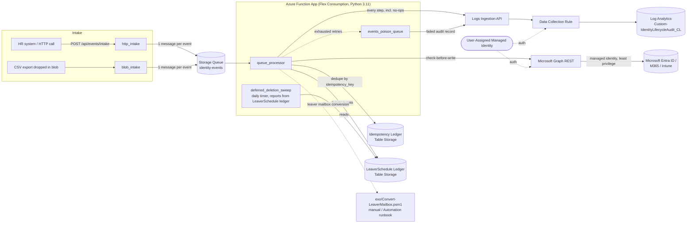

# Identity Lifecycle Automation (Joiner / Mover / Leaver)

Event-driven joiner/mover/leaver automation for Microsoft Entra ID + Microsoft
365, built as public engineering evidence for manual IAM operations experience.
An Azure Function (Python v2 programming model) processes HR lifecycle events
from a queue, calls Microsoft Graph with least-privilege, managed-identity
auth, and writes a full audit trail to a Log Analytics custom table.

**Jira:** Epic [EP-1](https://spreadcomgh.atlassian.net/browse/EP-1), stories EP-7…EP-13
**Status:** Build complete through EP-13 scope (code, infra-as-code, CI/CD
definitions, tests, docs). Cloud deployment and end-to-end testing on a real
tenant are separate, tracked steps — see [Remaining TODOs](#remaining-todos).

---

## Architecture



> **Known gap on Flex Consumption (tracked, not yet fixed):** `blob_intake`
> currently uses the classic polling Blob Storage trigger. Flex Consumption
> only supports the **Event Grid** blob trigger source — the polling trigger
> deploys without error but never fires. Until `function_app.py`'s
> `blob_intake` is converted to `source=func.BlobSource.EVENT_GRID` and a
> matching Event Grid system topic + subscription is added to
> `infra/modules/storage.bicep`, treat CSV-drop intake as non-functional and
> use `http_intake` instead. `http_intake`, `queue_processor`,
> `events_poison_queue`, and `deferred_deletion_sweep` are unaffected (queue
> and timer triggers are fully supported on Flex Consumption).
>
> `blob_intake` is additionally **gated behind the `ENABLE_BLOB_INTAKE` app
> setting (default off — unset/`false`)** until it is converted to the Event
> Grid source. The function stays defined in code; it is simply not registered
> with the runtime until then. See "Remaining TODOs" below.

### Known issue (RESOLVED): app registered zero functions on Flex Consumption

For several days every dev deploy produced a Function App with **zero**
functions registered. Recording the RCA here because essentially every
plausible-looking lead was wrong, and the real cause is invisible in logs.

**Symptom.** `az functionapp function list` empty and `/admin/functions`
empty. App Insights showed, on every host start:
`Loading functions metadata` -> `Reading functions metadata (Custom)` ->
`0 functions found (Custom)` -> `0 functions loaded` ->
`RpcFunctionInvocationDispatcher received no functions`, all in under a
millisecond, with **no Python worker process ever started** and **no error,
warning or exception anywhere** — not in App Insights traces at Debug level,
not in the deployment logs, not in the host's `errors` collection.

**Root cause.** `http_intake` was annotated
`outqueue: func.Out[list[str]]`. The Azure Functions Python **v2 programming
model** indexes the app by reflecting over each decorated function's parameter
annotations to match them to their declared bindings. It cannot resolve a
**PEP 585 builtin generic** (`list[str]`) nested inside `func.Out[...]`; only
`typing.List[str]` works. Critically, that one unresolvable annotation makes
indexing fail **for the entire function app**, not just the offending
function — so all four functions disappeared, and the failure is reported as
"0 functions" rather than as an error.

**Fix.** Use `typing.List[str]` (not `list[str]`) inside `func.Out[...]` in
`function_app.py`, and keep that module free of
`from __future__ import annotations` so trigger annotations are real objects
rather than strings. `identity_lifecycle/*` is never indexed by the worker, so
it is unaffected and still uses builtin generics freely.

**Proven by bisection against the live dev app** (each step a real deploy):

| Package | Result |
| --- | --- |
| Minimal 1-function HTTP app | 1 function registered |
| + `queueTrigger` + `timerTrigger` + `%EVENTS_QUEUE_NAME%-poison` | 4 registered |
| + one `@app.route` + `@app.queue_output` fn with `func.Out[list[str]]` | **0 registered** |
| same, changed to `func.Out[List[str]]` | 5 registered |

**Leads that were investigated and are *not* the cause** — don't re-litigate
these: the Bicep `functionAppConfig` (correct; `FUNCTIONS_WORKER_RUNTIME=python`
and `FUNCTIONS_WORKER_RUNTIME_VERSION=3.11` are injected by the platform and
must *not* be set as app settings — ARM rejects them on Flex); the
UserAssignedIdentity deployment-storage auth and its `Storage Blob Data
Contributor` role assignment (present and working — the package mounts, and
`host.json` is read, proven by `functionTimeout` showing up in
`ScriptJobHostOptions`); Python 3.11 on Flex in eastus2 (supported, EOL Oct
2027); the deployment package layout (correct Oryx output with
`.python_packages/lib/site-packages`); dependency imports (all 15 modules
import successfully in **847 ms** total on-device); the extension bundle and
queue/timer bindings (resolve fine); `PYTHON_ENABLE_INIT_INDEXING`;
`metadataProviderTimeout`; and `Azure/functions-action@v1` (the failure
reproduces identically deploying by hand via the Flex `/api/publish` endpoint).

A **second, independent** bug was fixed at the same time: the CI smoke check
ran `az functionapp function list --query "[].name"`, which returns ARM child
resource names (`<app-name>/<function-name>`), and matched them with
`grep -qx "<function-name>"` — a whole-line match that could never succeed.
That check would have failed even once the app was healthy.

**Design choices worth calling out:**

- **Plain REST + a thin `GraphClient` wrapper (`identity_lifecycle/graph_client.py`)**
  instead of the full `msgraph` SDK — smaller dependency surface, and every
  method is easy to fake in unit tests without mocking a generated client.
- **Check-before-write everywhere.** Every `GraphClient` mutation method reads
  current state first and no-ops if the desired state already holds. That's
  what makes a flow safe to replay even if the event-level idempotency ledger
  were unavailable.
- **Two layers of idempotency**: mutation-level (above) plus an event-level
  ledger keyed on `(event_type, idempotency_key)` in Azure Table Storage, so a
  Storage Queue redelivery (at-least-once) short-circuits before making any
  Graph calls at all. `idempotency_key` — not `correlation_id` — is the dedupe
  key: `correlation_id` is purely a trace id and defaults to a fresh `uuid4`
  on every parse, which would defeat dedup on a replayed CSV/blob row.
  `idempotency_key` is either the caller-supplied `correlation_id` (if the
  source payload set one explicitly) or a deterministic hash of
  `event_type|upn|effective_date|source|row-hash` when it didn't — see
  `identity_lifecycle/models.py`.
- **Permanent vs. transient failure handling.** `queue_processor` classifies
  every failed flow step: a data/config problem (UPN not found, group
  missing) is a *permanent* failure — recorded and not retried, since retrying
  the identical message fails the same way every time. Throttling/timeouts/5xx
  that survived `GraphClient`'s own bounded retry are *transient* — the
  message is left to retry via the host's normal queue redelivery. A message
  that exhausts `host.json`'s `maxDequeueCount` lands on the Storage Queue's
  automatic `-poison` queue, where `events_poison_queue` records a final
  failed audit entry so it's visible in the audit trail instead of silently
  vanishing.
- **Audit logging never fails a flow.** `AuditLogger` tries the Log Analytics
  Logs Ingestion API first; any failure (including "not configured", e.g.
  local dev) falls back to structured JSON logging, and the exception is
  swallowed — an audit sink outage must never block a joiner/mover/leaver
  action from completing.
- **EXO mailbox conversion is isolated.** Exchange Online mailbox operations
  aren't reachable the same way directory objects are via Graph application
  permissions in a Python Function App without extra plumbing, so mailbox
  conversion is a separate, documented PowerShell module
  (`exo/Convert-LeaverMailbox.psm1`) run manually or from an Azure Automation
  runbook — see [Leaver flow](#leaver-flow).
- **Deferred deletion is reporting-only, on purpose.** The leaver flow
  computes a 30-day deletion due date and persists it durably to the
  `LeaverSchedule` Table Storage ledger (`identity_lifecycle/leaver_schedule.py`)
  — it never deletes anything. The daily timer function
  (`deferred_deletion_sweep`) reads that ledger back and audits every account
  past its due date, but is a deliberate v1 safety rail: it never calls
  Graph's delete endpoint. Wiring in the real (confirmed, gated) delete call
  is a tracked fast-follow once the flows are validated end-to-end on the dev
  tenant.

---

## Repository layout

```
function_app.py               Azure Functions v2 entrypoint (5 triggers)
identity_lifecycle/            Package lives at repo root, not under src/ — Oryx
                               (Azure's build system) only runs `pip install -r
                               requirements.txt` and packages what's left; a
                               src/-nested package would not be importable by
                               the deployed app at all.
  config.py                   Settings from env vars + department->group mapping
  models.py                   UserEvent / ParsedBatch pydantic schemas
  parsing.py                  CSV/JSON intake -> validated UserEvent list
  graph_client.py             Thin Graph REST wrapper, check-before-write, pagination, retry/backoff
  idempotency.py               Event-level dedupe ledger (in-memory + Table Storage)
  leaver_schedule.py          Durable leaver deferred-deletion schedule (in-memory + Table Storage)
  audit.py                    Structured audit logging (Log Analytics + local fallback)
  flows/
    base.py                   FlowOutcome / FlowStep result types, transient-failure classification
    joiner.py                 Joiner flow
    mover.py                  Mover flow
    leaver.py                 Leaver flow
exo/
  Convert-LeaverMailbox.psm1  Isolated EXO mailbox-conversion module (manual/Automation)
infra/
  main.bicep                  Orchestrator (dev/prod parameterized)
  modules/                    managed identity, storage, Log Analytics/DCR, App Insights, Function App
  parameters/                 dev.bicepparam, prod.bicepparam
.github/workflows/
  ci.yml                      ruff + pytest + bicep build + deploy (dev/prod), deploy gated on the test/lint jobs
.funcignore                   Excludes tests/infra/.github/samples/docs/*.md from the deployment package
tests/unit/                   pytest suite (parsing, idempotency, each flow, audit, graph client, function_app)
samples/                      Example joiner/mover/leaver CSV + JSON payloads
```

---

## Flow descriptions

### Joiner flow (EP-9)

Trigger: an HR "new hire" event (HTTP call or CSV row).

1. Create the Entra user if it doesn't already exist (idempotent on UPN;
   tolerant of a concurrent redelivery racing to create the same UPN — a
   409/400 "already exists" from Graph is treated as success, not an error).
2. Reconcile `displayName`/`jobTitle`/`department`/`employeeId` to the event's
   values — runs every time, including replays, so a corrected re-send after
   a partial failure self-heals attribute drift instead of only ever setting
   these at creation time.
3. Set the manager reference, if `manager_upn` is supplied and resolves.
4. Add the user to their department's security group and group-based
   licensing group (see [department mapping](#department--group-mapping) below)
   — one `memberOf` read for the whole event, reused for every candidate group.
5. Issue a Temporary Access Pass for passwordless first sign-in (a usable
   existing pass short-circuits this; an expired/consumed one does not).
6. Send a welcome email with sign-in instructions — **only** on the run that
   actually created the user (gated on the `created` flag), so replaying the
   event never sends a duplicate email even though Graph has no "already
   emailed" state to check. Sent from a dedicated no-reply/service mailbox
   (`WELCOME_MAIL_SENDER`), **never** the just-created user — that mailbox
   isn't provisioned yet and `sendMail`-as-self fails with
   `MailboxNotEnabledForRESTAPI`. A send failure degrades this one step to
   `failed`; it never aborts the rest of the flow, which has already
   completed by this point.

Re-sending the same joiner event is safe: every step observes the target
state already holds and reports `skipped`, and zero additional Graph writes
happen (see `tests/unit/test_joiner.py::test_joiner_replay_is_fully_idempotent`).

### Mover flow (EP-10)

Trigger: a department/manager/title change event.

Rather than inferring the user's *previous* department from the event (HR
feeds don't reliably supply it), the flow treats the union of every group
referenced by any configured department mapping as "automation-managed" and
reconciles membership to exactly what the *new* department maps to — added if
missing, removed if no longer in scope, left untouched if it's not a
managed group at all (e.g. a manually-added project group). One `memberOf`
read covers the whole event, reused for every managed group instead of one
Graph call per group. **Every addition happens before any removal** — never
interleaved alphabetically by group name — so the user is never left with
neither the old nor the new department's access mid-reconciliation. Job title,
department attribute, and manager are updated the same check-before-write way.
Every change (and no-op) is logged, plus one `access_recertification_note`
audit record summarizing the change — the artifact a reviewer would check
during a periodic access recertification.

### Leaver flow (EP-11)

Trigger: a termination event.

1. Disable the account (idempotent).
2. Revoke all sign-in sessions (`revokeSignInSessions` — Graph makes repeated
   revocation harmless, so this step always runs and always logs `success`;
   it's the one documented exception to "no Graph calls on replay").
3. Remove the user from every automation-managed group — one `memberOf` read
   for the whole event, reused for every managed group.
4. Retire every Intune-managed device owned by the user (idempotent — skips
   devices already pending/retired; a device in any state other than an
   already-in-progress retirement gets a retire command issued).
5. **Flag** the mailbox for shared-mailbox conversion — audited, but never
   executed from this function. Run `exo/Convert-LeaverMailbox.psm1` manually
   against the audit log's flagged UPNs, or wire it into an Azure Automation
   runbook that queries the audit table for un-converted leavers (see
   [Operational runbook](#operational-runbook-exo-mailbox-conversion) below).
   This isolation exists because EXO mailbox operations need the
   `ExchangeOnlineManagement` PowerShell module and an Exchange
   Administrator-scoped identity — not something worth plumbing a second auth
   path for in a Python Azure Function for v1.
6. Compute a deferred-deletion due date
   (`last_day_of_work + LEAVER_DEFERRED_DELETE_DAYS`, default 30) and persist
   it durably to the `LeaverSchedule` Table Storage ledger
   (`identity_lifecycle/leaver_schedule.py`, `PartitionKey="LeaverSchedule"`).
   **No deletion happens here or in the timer function that reads this
   ledger** — see [Architecture](#architecture) above.

### Audit logging (EP-12)

Every decision a flow makes — including "checked, already correct, did
nothing" — is written as one `AuditRecord` via `AuditLogger.record(...)`:
`correlation_id`, `event_type`, `action`, `target`, `result`
(`success`/`skipped`/`failed`/`info`), `detail`, plus flow-specific extras
(`extra`). Primary sink is the Logs Ingestion API into the
`Custom-IdentityLifecycleAudit_CL` Log Analytics table (via the DCE/DCR
provisioned in `infra/modules/log-analytics.bicep`), authenticated with the
function's managed identity (`Monitoring Metrics Publisher` role, scoped to
just that DCR). The DCR declares `extra` as a `string` column, so it's
serialized with `json.dumps(..., default=str)` before upload rather than sent
as a raw JSON object, which would mismatch the declared schema. If the
endpoint isn't configured (local dev) or the call fails, it falls back to
structured JSON logging — audit logging can never fail a flow — and a
warning-level "fallback count" metric log is emitted so a sustained ingestion
outage is visible/alertable, not just quietly absorbed.

Every event's `correlation_id` threads through every audit row for that
event, so a single HR event is traceable end-to-end with one KQL query:

```kql
IdentityLifecycleAudit_CL
| where correlation_id == "<id>"
| order by TimeGenerated asc
```

(the table's column schema — including plain `correlation_id`, not an
auto-suffixed `correlation_id_s` — is declared explicitly in
`infra/modules/log-analytics.bicep` rather than left to Log Analytics'
dynamic-JSON column inference.)

---

## Permissions

All Graph access is via a single **user-assigned managed identity** with
**application permissions** (no delegated/user auth, no client secrets).
Least-privilege — every permission maps to a specific call a flow makes.

| Graph permission (Application) | Used for | Justification |
|---|---|---|
| `User.ReadWrite.All` | Create users (joiner), patch attributes (mover), disable accounts (leaver) | Directory write is unavoidable for provisioning/deprovisioning; scoped to Users only, not `Directory.ReadWrite.All` |
| `Group.Read.All` | Resolve a department's group by display name (`GET /groups?$filter=...`), read `memberOf` | Read-only group lookup — every group *write* goes through the narrower `GroupMember.ReadWrite.All` below, not this permission |
| `GroupMember.ReadWrite.All` | Add/remove group membership (joiner group-based licensing + access, mover reconciliation, leaver full removal), read `memberOf` for the idempotency check | Narrower alternative to `Group.ReadWrite.All`: grants membership read/write without granting group *object* write (rename, delete, ownership changes) — this automation only ever needs to change who's in a group, never the group itself |
| `UserAuthenticationMethod.ReadWrite.All` | Issue Temporary Access Pass (joiner) | Needed for passwordless first sign-in instead of emailing a plaintext password |
| `Mail.Send` | Welcome email (joiner), sent from the dedicated `WELCOME_MAIL_SENDER` no-reply mailbox — never the just-created user | `Mail.Send` is an application permission that by default lets the app send as *any* mailbox in the tenant; constrain that blast radius with an Exchange Online `ApplicationAccessPolicy` scoped to just the no-reply mailbox (see Setup guide step 3a below) rather than relying on the app never choosing to send as anyone else |
| `DeviceManagementManagedDevices.ReadWrite.All` | List + retire Intune-managed devices (leaver) | Retire (not full wipe) is the least-destructive Intune action that revokes corporate access while leaving personal BYOD data alone where applicable |
| `DeviceManagementManagedDevices.PrivilegedOperations.All` | Issue the `retire`/`wipe` remote action against a managed device | `ReadWrite.All` alone covers reading and patching a managedDevice object, but the retire/wipe remote actions are gated behind this separate "privileged operations" permission — without it, `ensure_device_retired`'s `POST .../retire` call is rejected with a 403 even though the read succeeds |

**Not granted, by design:**

- `Group.ReadWrite.All` — this automation never creates, renames, or deletes
  a group, or changes ownership; `Group.Read.All` + `GroupMember.ReadWrite.All`
  cover every Graph call this codebase actually makes.
- `Directory.ReadWrite.All` — too broad; nothing here touches directory
  settings, roles, or other administrative objects.
- `Mail.ReadWrite` — the function only sends, never reads, mail.
- No Exchange Online / EXO Graph scope — mailbox conversion is isolated to
  the PowerShell module (see [Leaver flow](#leaver-flow)), run with a
  separate Exchange Administrator-scoped identity.

### Log Analytics

| Role | Scope | Used for |
|---|---|---|
| Monitoring Metrics Publisher | The specific Data Collection Rule (`idlc-<env>-dcr`), not the workspace | Narrowest built-in role that can call the Logs Ingestion API for that one DCR |

---

## Department -> group mapping

v1 simplification, documented rather than hidden: `identity_lifecycle/config.py`
ships a small static `department -> {security_groups, license_group}` mapping
(`Engineering`, `Sales`, `Finance`, `HR` by default). A production rollout
would source this from an HR system of record or a Graph-backed configuration
list instead of a code constant — tracked as a fast-follow, not attempted here
to keep the v1 scope demonstrable and testable.

---

## Setup guide (EP-7: dev tenant, app registration, GitHub OIDC)

These steps are documentation for the *next* phase (cloud deployment), not
yet executed against a real tenant as part of this build.

1. **Dev tenant.** Create (or designate) an isolated Microsoft 365 developer
   tenant, separate from any production tenant — Microsoft 365 Developer
   Program tenants include E5 dev licenses, sufficient for group-based
   licensing testing.

2. **User-assigned managed identity.** Deployed by `infra/main.bicep`
   (`idlc-<env>-uami`). No app registration/client secret is created for
   Graph auth — the Function App authenticates as this identity via
   `DefaultAzureCredential`.

3. **Grant Graph application permissions to the managed identity.** Managed
   identities can't self-service Graph app role consent in the portal the way
   an app registration can; grant via Microsoft Graph PowerShell or CLI,
   using the identity's **principal ID** (an output of the Bicep deployment):

   ```powershell
   Connect-MgGraph -Scopes "AppRoleAssignment.ReadWrite.All"
   $miPrincipalId = "<managedIdentityPrincipalId output>"
   $graphSpId = (Get-MgServicePrincipal -Filter "appId eq '00000003-0000-0000-c000-000000000000'").Id
   $permissions = @(
     "User.ReadWrite.All", "Group.Read.All", "GroupMember.ReadWrite.All",
     "UserAuthenticationMethod.ReadWrite.All", "Mail.Send",
     "DeviceManagementManagedDevices.ReadWrite.All",
     "DeviceManagementManagedDevices.PrivilegedOperations.All"
   )
   foreach ($perm in $permissions) {
     $role = Get-MgServicePrincipal -ServicePrincipalId $graphSpId |
       Select-Object -ExpandProperty AppRoles |
       Where-Object { $_.Value -eq $perm -and $_.AllowedMemberTypes -contains "Application" }
     New-MgServicePrincipalAppRoleAssignment -ServicePrincipalId $miPrincipalId `
       -PrincipalId $miPrincipalId -ResourceId $graphSpId -AppRoleId $role.Id
   }
   ```

   **3a. Constrain `Mail.Send` to the no-reply mailbox.** `Mail.Send` as an
   application permission can send as *any* mailbox in the tenant by default.
   Scope it down with an Exchange Online `ApplicationAccessPolicy` so the
   managed identity can only ever send as `WELCOME_MAIL_SENDER`:

   ```powershell
   Connect-ExchangeOnline
   New-DistributionGroup -Name "idlc-mail-senders" -Members "no-reply@yourtenant.onmicrosoft.com"
   New-ApplicationAccessPolicy -AppId "<managed identity's client ID>" `
     -PolicyScopeGroupId "idlc-mail-senders" -AccessRight RestrictAccess `
     -Description "Identity Lifecycle Automation may only send mail as the no-reply mailbox"
   Test-ApplicationAccessPolicy -AppId "<managed identity's client ID>" -Identity "no-reply@yourtenant.onmicrosoft.com"
   ```

4. **GitHub OIDC federation.** Create an app registration (used only as the
   OIDC identity for GitHub Actions — separate from the runtime managed
   identity above) with a federated credential per environment:

   ```bash
   az ad app create --display-name "identity-lifecycle-automation-gha"
   az ad app federated-credential create --id <appId> --parameters '{
     "name": "gha-dev-branch",
     "issuer": "https://token.actions.githubusercontent.com",
     "subject": "repo:<org>/identity-lifecycle-automation:ref:refs/heads/dev",
     "audiences": ["api://AzureADTokenExchange"]
   }'
   az ad app federated-credential create --id <appId> --parameters '{
     "name": "gha-master-branch",
     "issuer": "https://token.actions.githubusercontent.com",
     "subject": "repo:<org>/identity-lifecycle-automation:ref:refs/heads/master",
     "audiences": ["api://AzureADTokenExchange"]
   }'
   ```

   Grant this app registration `Contributor` on the target resource group
   (infra deploy) — least-privilege would be a custom role scoped to the
   specific resource types in `infra/`, tracked as a fast-follow.

   Set as **environment-scoped variables** on each GitHub Environment
   (`dev` and `production` — see step 5), not repository-level variables —
   not secrets either, these are identifiers: `AZURE_CLIENT_ID`,
   `AZURE_TENANT_ID`, `AZURE_SUBSCRIPTION_ID`, `AZURE_RESOURCE_GROUP`. Each
   deploy job in `ci.yml` verifies all four are set on its environment before
   attempting `azure/login` and fails fast with a clear `::error::` annotation
   naming the missing variable(s) if not, rather than failing deep inside
   `az login` with an opaque error.

5. **GitHub Environments.** Create `dev` and `production` environments in the
   repo, and set the four variables above on *each* one. Add a
   required-reviewer protection rule on `production` — that's what makes
   `ci.yml`'s `deploy-prod` job "gated on master" in practice, on top of the
   branch-based dev->test->approve->prod workflow itself and the
   `needs: [lint-and-test, bicep-lint]` gate that keeps a deploy from ever
   running off a commit that failed CI.

---

## Local development

```bash
py -3.11 -m venv .venv
.venv\Scripts\activate            # Windows
pip install -r requirements-dev.txt
cp local.settings.json.sample local.settings.json   # not committed — see .gitignore
ruff check .
pytest -q --cov
```

Running the Functions host locally (`func start`) additionally needs
[Azurite](https://learn.microsoft.com/azure/storage/common/storage-use-azurite)
for `AzureWebJobsStorage=UseDevelopmentStorage=true`, and `az login` for
`DefaultAzureCredential` to pick up delegated Graph auth in place of managed
identity. Set `WELCOME_MAIL_SENDER` in `local.settings.json` to a mailbox your
dev-tenant account can send as, or joiner's welcome-mail step will log a
`failed` (not fatal) step every run.

---

## Testing

```bash
pytest -q --cov --cov-report=term-missing --cov-fail-under=85
```

100+ unit tests cover: event parsing/validation (CSV + JSON, malformed rows,
partial-batch success, path-traversal/UPN-injection rejection), the
idempotency ledger, each flow's decision logic against a hand-rolled
`FakeGraphClient` (including full-replay idempotency assertions per flow, and
mover's additions-before-removals ordering), the real `GraphClient`'s
check-before-write HTTP behaviour for every method (via `respx`, asserting
exact URL/method/body), retry/backoff on 429/503, `function_app.py`'s
`queue_processor` (replay short-circuit, dispatch, permanent-failure path,
transient-failure/exception path, unparseable message) and
`events_poison_queue`, and the audit logger's Log Analytics/local-fallback
branching. No test calls a real Azure or Graph endpoint. CI enforces
`--cov-fail-under=85`.

---

## Entra ID Governance — the enterprise-grade alternative

This project deliberately builds joiner/mover/leaver logic by hand to
demonstrate Graph API, event-driven design, idempotency, and audit-logging
engineering. In a production Microsoft-centric environment, **Microsoft Entra
ID Governance** (Entitlement Management, Access Reviews, Lifecycle Workflows)
is the enterprise-grade, lower-maintenance alternative for most of this scope:

- **Lifecycle Workflows** natively cover joiner/mover/leaver triggers
  (attribute changes, HR-driven via Entra ID + HR connectors like Workday/
  SuccessFactors) with built-in tasks for account creation, group/license
  assignment, and disablement — no custom code to maintain.
- **Entitlement Management** replaces the static department->group mapping
  here with access packages, approval workflows, and time-bound assignments.
- **Access Reviews** replace the `access_recertification_note` audit record
  with a first-class, schedulable recertification workflow with reviewer
  UI and reporting.

Trade-off: Governance requires Entra ID P2 licensing and is less flexible for
bespoke logic (e.g. the specific device-retire-not-wipe policy, or writing to
a custom Log Analytics table in this exact shape) than a Function App you
control. This project is the right choice when demonstrating the underlying
mechanics is the goal; Governance is the right choice for a real enterprise
rollout once the mechanics are understood.

---

## Descoped (explicitly, not by omission)

These are deliberately **not** covered by any flow in this build, called out
here so their absence reads as a scoping decision rather than a gap someone
has to go discover:

- **Teams / SharePoint provisioning.** No flow creates or adds the user to
  Teams, SharePoint sites, or Microsoft 365 Groups beyond the security/license
  groups in the [department mapping](#department--group-mapping). A real
  rollout would typically drive this via Entra ID Governance access packages
  (see above) or a dedicated Teams/SharePoint provisioning step — out of
  scope here to keep the joiner/mover/leaver mechanics demonstrable.
- **Exchange Online mailbox conversion execution.** The leaver flow flags
  mailbox conversion in the audit trail but never runs it — see
  [Operational runbook](#operational-runbook-exo-mailbox-conversion) below.
- **Actual account deletion.** The deferred-deletion sweep reports past-due
  leaver accounts; it never calls Graph's delete endpoint (see
  [Architecture](#architecture)).

---

## Operational runbook: EXO mailbox conversion

The leaver flow records a `flag_mailbox_conversion` audit entry for every
leaver — it never calls Exchange Online itself (see
[Leaver flow](#leaver-flow)). Run `exo/Convert-LeaverMailbox.psm1` against
each flagged UPN manually, or wire it into a scheduled Azure Automation
runbook. Either way, start from the audit table: this KQL query lists every
leaver flagged for conversion that hasn't since been converted (i.e. no
`convert_to_shared`/`success` audit record exists for that UPN — see
`exo/Convert-LeaverMailbox.psm1`, which emits exactly that `Action`/`Result`
shape when run):

```kql
let flagged = IdentityLifecycleAudit_CL
    | where action == "flag_mailbox_conversion"
    | summarize FlaggedAt = min(TimeGenerated) by target;
let converted = IdentityLifecycleAudit_CL
    | where action == "convert_to_shared" and result == "success"
    | summarize by target;
flagged
| join kind=leftanti converted on target
| project UserPrincipalName = target, FlaggedAt
| order by FlaggedAt asc
```

Run `Convert-LeaverMailbox -UserPrincipalName <UserPrincipalName>` (from the
query above) for each row, or feed the whole list to an Automation runbook
that calls it in a loop. The module is idempotent (`RecipientTypeDetails eq
"SharedMailbox"` short-circuits), so re-running it against an
already-converted mailbox is safe.

**Note:** `Convert-LeaverMailbox` currently returns its result as a
PowerShell object (`Action`/`Result`/`Detail`), not a Log Analytics audit
record — the KQL above assumes a runbook wrapper also POSTs that result to
the same Logs Ingestion API/DCR the Python function uses (matching the
`action`/`result`/`target` shape). Wiring that write is a small, tracked
fast-follow; until then, treat the `flagged` half of the query as the
authoritative worklist and track completion manually.

---

## Remaining TODOs (needs Kwasi / cloud access)

Everything up to cloud deployment and end-to-end testing is complete. Not
done, and requiring tenant/subscription access this build didn't have:

1. **Provision the dev tenant** (or confirm an existing one) per the Setup
   guide above — this was originally EP-7 and is unblocked but not executed.
2. **Deploy infra to Azure**: `az deployment group create --resource-group <rg> --template-file infra/main.bicep --parameters infra/parameters/dev.bicepparam` (needs `defaultDomain` and `welcomeMailSender` filled in with real tenant values — currently placeholders in both `.bicepparam` files).
3. **Grant the managed identity's Graph app roles** (script provided in Setup
   guide step 3) — requires Global Administrator or Privileged Role
   Administrator in the target tenant — and **scope `Mail.Send`** with the
   Exchange `ApplicationAccessPolicy` in step 3a.
4. **Set up GitHub OIDC federation + environment-scoped variables** (Setup
   guide step 4) on both the `dev` and `production` GitHub Environments, once
   the repo is pushed to GitHub.
5. **Push this repo to GitHub, watch CI go green**, then let `ci.yml`'s
   `deploy-dev` job (gated on `lint-and-test` + `bicep-lint` passing) deploy
   dev on the first `dev` push.
6. **End-to-end demo run** on the dev tenant: submit the `samples/` payloads
   through `http_intake`, confirm Graph state changes and the audit trail in
   Log Analytics, record a demo (EP-13's remaining acceptance criterion).
7. **Convert `blob_intake` to the Event Grid trigger source** (see the "Known
   gap on Flex Consumption" callout under Architecture above) — required
   before CSV-drop intake is usable; not required for `http_intake` or the
   rest of the pipeline. Once converted, add an `ENABLE_BLOB_INTAKE=true`
   app setting (`infra/modules/function-app.bicep`'s `appSettings` array
   currently has no entry for it — add one) to register it; until then
   it's intentionally left unregistered (see the callout).
8. **Approve dev -> master PR** once dev is manually tested, per the standard
   workflow.
